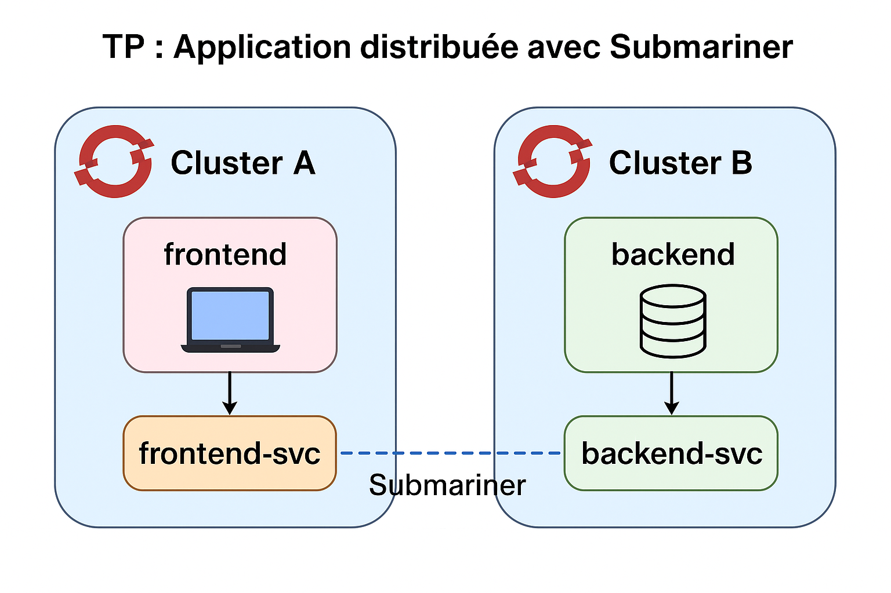

# TP : Application distribuée avec Submariner

## Objectif pédagogique

Découvrir comment déployer et interconnecter une application distribuée entre plusieurs clusters OpenShift grâce à **Submariner**, afin de permettre la communication transparente entre pods de clusters différents.

---

## Contexte

Vous disposez de deux clusters OpenShift distincts, situés dans des réseaux différents (Cluster A et Cluster B).
Votre mission est de mettre en place Submariner pour permettre à une application **frontend** déployée sur le Cluster A de communiquer avec une **base de données** (ou API backend) hébergée sur le Cluster B.



---

## Prérequis

* Deux clusters OpenShift 4.x opérationnels avec un accès administrateur.
* CLI installées :

  * `oc`
  * `subctl`
* Droits d’administration sur les clusters.
* Un registre d’images (public ou privé) disponible.

---

## Étapes du TP

### 1. Préparation des clusters

1. Vérifiez l’accès aux deux clusters avec `oc whoami` et `oc get nodes`.
2. Identifiez vos contextes :

   ```bash
   oc config get-contexts
   ```

   Notez les contextes pour `cluster-a` et `cluster-b`.

---

### 2. Installation de Submariner

1. Téléchargez l’outil Subctl si nécessaire :

   ```bash
   curl -Ls https://get.submariner.io | bash
   ```
2. Connectez-vous au premier cluster et installez le broker Submariner :

   ```bash
   subctl deploy-broker --kubeconfig ~/.kube/config --context cluster-a
   ```
3. Récupérez le fichier d’attachement généré (ex: `broker-info.subm`).
4. Joignez le **Cluster A** en tant que membre :

   ```bash
   subctl join broker-info.subm --kubeconfig ~/.kube/config --context cluster-a
   ```
5. Joignez le **Cluster B** avec le même fichier :

   ```bash
   subctl join broker-info.subm --kubeconfig ~/.kube/config --context cluster-b
   ```
6. Vérifiez l’état du déploiement :

   ```bash
   subctl show all --kubeconfig ~/.kube/config --context cluster-a
   ```

---

### 3. Déploiement de l’application

#### Sur le Cluster B (Backend)

1. Créez un projet `backend`:

   ```bash
   oc new-project backend
   ```
2. Déployez un simple service (exemple : API REST ou base de données Postgres).

   ```bash
   oc run backend --image=quay.io/bitnami/postgresql:latest \
     --env="POSTGRES_PASSWORD=admin" --env="POSTGRES_USER=user" --env="POSTGRES_DB=mydb"
   ```
3. Exposez le service :

   ```bash
   oc expose pod backend --port=5432 --name=backend-svc
   ```
4. Vérifiez l’adresse IP attribuée au service (ClusterIP).

---

#### Sur le Cluster A (Frontend)

1. Créez un projet `frontend`:

   ```bash
   oc new-project frontend
   ```
2. Déployez une application simple (ex: Node.js ou Python Flask) configurée pour se connecter au service `backend-svc.backend.svc.cluster.local:5432`.
   Exemple minimal avec Python :

   ```bash
   oc run frontend --image=python:3.9 --command -- \
     python -m http.server 8080
   ```
3. Exposez le service :

   ```bash
   oc expose pod frontend --port=8080 --name=frontend-svc
   ```

---

### 4. Test de la connectivité inter-clusters

1. Depuis le pod **frontend** (Cluster A), tentez de résoudre le service du backend (Cluster B) :

   ```bash
   oc rsh -n frontend <frontend-pod-name>
   ping backend-svc.backend.svc.cluster.local
   ```
2. Vérifiez que le trafic est routé par Submariner.
3. Testez l’accès à la base de données (si Postgres) :

   ```bash
   psql -h backend-svc.backend.svc.cluster.local -U user -d mydb
   ```

   (mot de passe : `admin`)

---

### 5. Validation

* Si la communication est réussie → l’application est distribuée entre deux clusters grâce à Submariner.
* Si cela échoue → vérifier :

  * L’état des Gateways Submariner (`oc get pods -n submariner-operator`)
  * Les règles de firewall entre les clusters
  * La bonne utilisation du fichier `broker-info.subm`

---

## Questions pour approfondir

1. Quels sont les avantages de Submariner par rapport à une simple exposition de service via LoadBalancer ou Route ?
2. Quelles limitations pouvez-vous rencontrer avec Submariner dans un contexte multi-cloud ?
3. Comment sécuriser davantage les communications entre clusters ?

-
